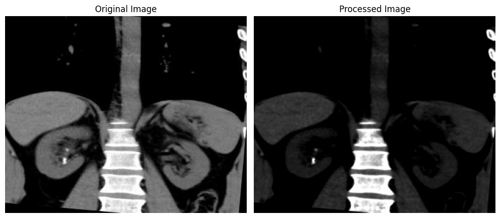
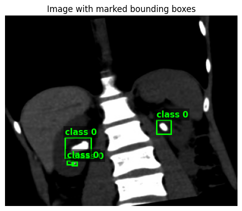

```python
from src.visualizations import *

compare_original_and_processed('data')
```


    

    


```python
plot_image_with_bboxes('data')
```


    

    


```python
from src.utils import *
import random

random.seed(2137)

img_path = get_processed_image_path(*get_random_image_id('data'))


img = cv.imread(img_path)
img.shape
```


    (320, 391, 3)


